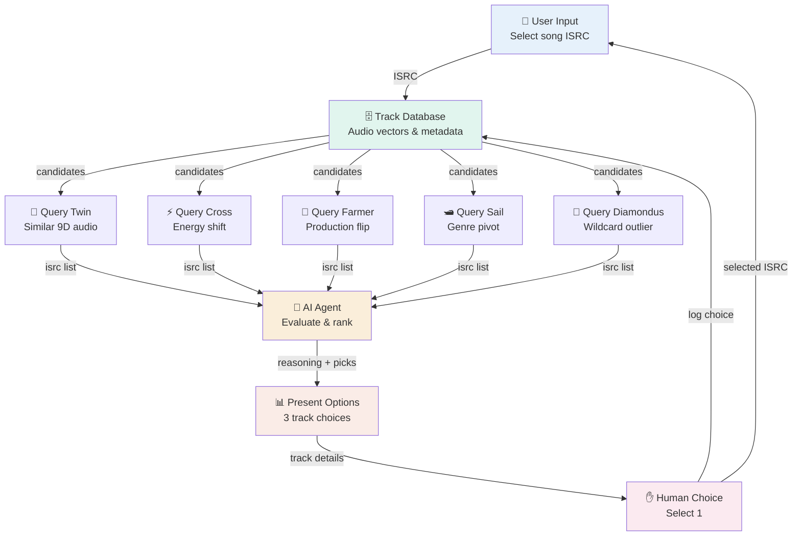

Use light mode or preview markdown elsewhere if hard to read

```mermaid
graph TD
    User["👤 User Input<br/>Select song ISRC"]
    DB["🗄️ Track Database<br/>Audio vectors & metadata"]
    
    Twin["🔄 Query Twin<br/>Similar 9D audio"]
    Cross["⚡ Query Cross<br/>Energy shift"]
    Farmer["🌾 Query Farmer<br/>Production flip"]
    Sail["🛥️ Query Sail<br/>Genre pivot"]
    Diamondus["💎 Query Diamondus<br/>Wildcard outlier"]
    
    Agent["🤖 AI Agent<br/>Evaluate & rank"]
    Present["📊 Present Options<br/>3 track choices"]
    Choice["✋ Human Choice<br/>Select 1"]
    
    User -->|ISRC| DB
    DB -->|candidates| Twin
    DB -->|candidates| Cross
    DB -->|candidates| Farmer
    DB -->|candidates| Sail
    DB -->|candidates| Diamondus
    
    Twin -->|isrc list| Agent
    Cross -->|isrc list| Agent
    Farmer -->|isrc list| Agent
    Sail -->|isrc list| Agent
    Diamondus -->|isrc list| Agent
    
    Agent -->|reasoning + picks| Present
    Present -->|track details| Choice
    Choice -->|selected ISRC| User
    
    Choice -->|log choice| DB
    
    style User fill:#e6f1fb
    style DB fill:#e1f5ee
    style Twin fill:#eeedfe
    style Cross fill:#eeedfe
    style Farmer fill:#eeedfe
    style Sail fill:#eeedfe
    style Diamondus fill:#eeedfe
    style Agent fill:#faeeda
    style Present fill:#faece7
    style Choice fill:#fbeaf0
```